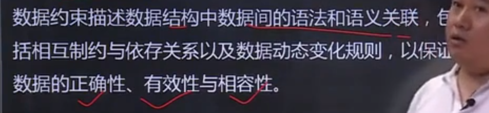
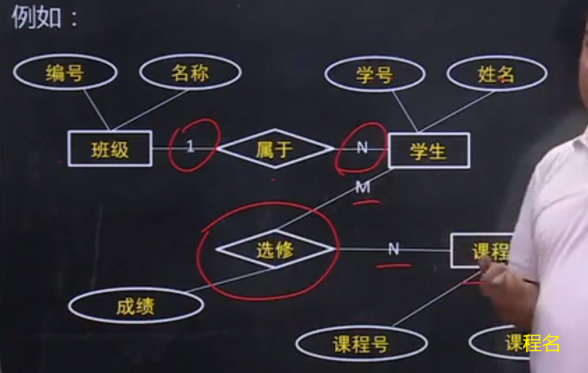
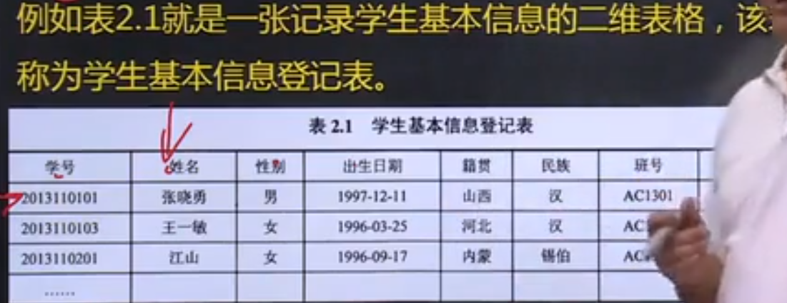
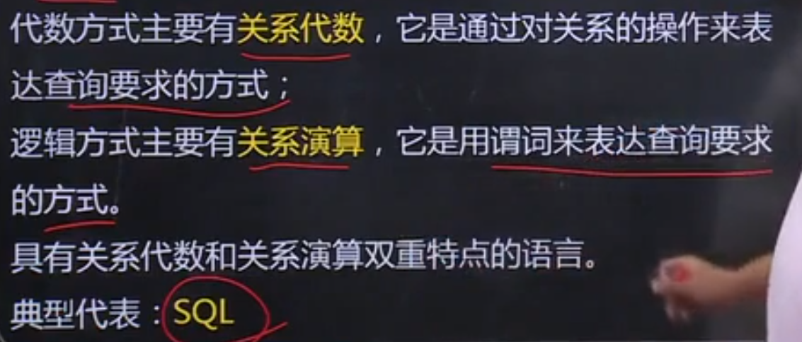
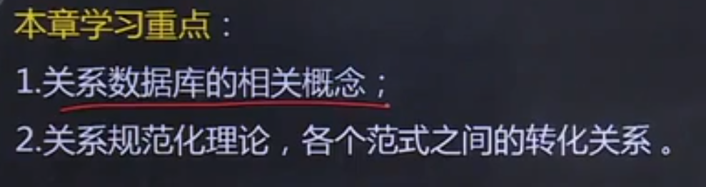
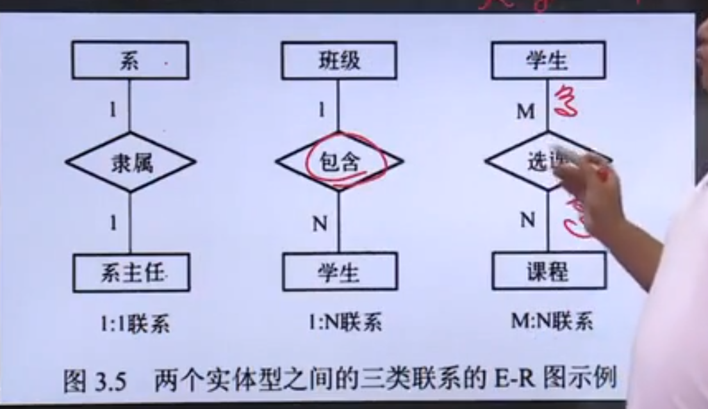
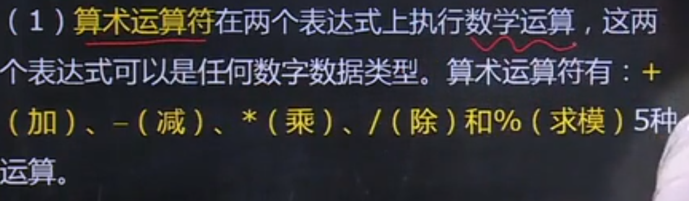
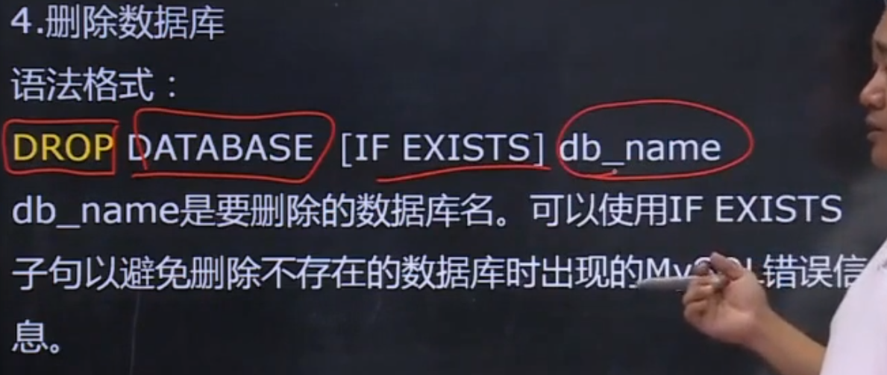
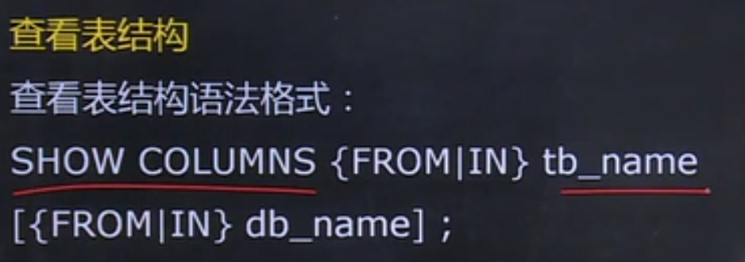
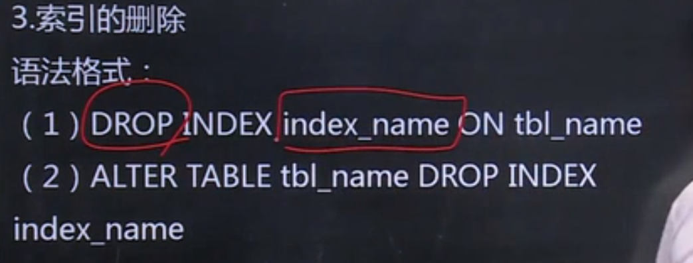

# 数据库系统原理


# 第一章 数据库系统概述

## 1.1 数据库基本概念

**数据**（Data）**是描述书屋的符号记录**，是指用物理符号记录下来的，可以鉴别的信息


**数据库** （Database，简称DB）**是长期储存在计算机有组织，可共享的大量数据集合。**

数据库中存储的数据具有**永久存储**、**有组织**和**可共享**三个基本特点


**数据库管理系统**（Database Management System 简称DBMS）是位于**用户与操作系统**之间的一层**数据管理软件**

主要功能：
1.**数据定义功能**

提供数据定义语言（DDL）定义数据库中的数据


2.**数据操纵功能**

提供数据操纵语言（DML）操纵数据实现对数据库的基本操作


3.**数据库的运行管理**


4.**数据库的建立和维护功能**


5.**数据组织、存储 和管理功能**


6.**其他功能**


**数据库系统**（Database System ，DBS）是在计算机中引入数据库技术之后的系统


## 1.2 数据库管理技术的发展

### 1.人工管理阶段


### 2. 文件系统阶段


### 3. 数据库系统阶段


## 1.3 数据库系统的结构

### 1.3.1 数据库系统的三级模式结构

**1.模式**


**2.外模式** 

​	外模式也称为子模式（Subschema）或用户模式，它被数据库用户（包括程序员和最终用户）能够看见和使用的局部数据的逻辑和特征的描述


**3.内模式**

​	内模式也称为存储模式（Storage Schema）它是对数据库中数据物理结构和存储方式的描述，是数据在数据库内部的表示形式


**4.三级模式结构的两层映像与数据独立性**

数据独立性包括两个

**（1）外模式/模式映像**（逻辑独立性）

**（2）模式/内模式映像**（物理独立性）


例题：


### 1.3.2 数据库系统的运行与应用结构

**1.客户/服务器 （Client/Server, C/S）模式**


**2.浏览器/服务器 （Browser/Server ，B/S）模式**


## 1.4 数据模型

### 1.4.1 数据特征与数据模型组成要素

**1.数据结构**

​	数据结构描述的是系统的**静态属性**


**2.数据操作**

​	数据操作描述的是系统的动态属性


3.数据的约束条件




### 1.4.2 数据模型的分类

#### **1.概念层数据模型**

（1）信息世界中的基本概念

- **实体（Entity）**

客观存在并可相互区别的事务称为实体。可以是具体的人、事、物或抽象的概念

- **属性（Attribute）**

实体所具有的某一特性称为属性。一个实体可以由若干个属性来刻画

- **码（key）**

唯一标识实体的**属性集**称为码

- **域（Domain）**

属性的取值范围称为该属性的域

- **实体型（Entity Type）**

用实体名及其属性名集合来抽象和刻画。同类实体称为实体型

- **实体集（Entity Set）**

同型实体的集合称为实体集 

- **联系（Relationship）**


实体型关系：

- **一对多** 1：N
- **一对一** 1:1
- **多对多** N:M


（2）**概念模型的表示方法**

概念模型：用来描述现实世界的事物，与具体的计算机系统无关


E-R图




#### 2.逻辑层数据模型

（1）层次模型

（2）网状模型

（3）**关系模型**

（4）面向对象模型


#### 3.物理层数据模型


## 小结


# 第二章 关系数据库

## 2.1 关系数据库概述


## 2.2 关系数据模型

### 2.2.1关系数据结构

​	关系模型的数据结构非常简单，只包含单一的数据结构，即关系。-》**二维表**




基本术语：

1. **表（Table）**

表，也称为关系 ，是一个二维的数据结构，由表名、构成表的各个列（如学号、姓名等）及若干行数据（每个学生的具体信息）组成

2. **关系（Relation）**

一个关系逻辑上对应一张二维表，可以为每个关系取个名称进行标识

3. **列（Column）**

表中的列，也称为字段（Field）或属性（Attribute）

表中每一列有一个名称，称为列名、字段名或属性名

一列表示实体的一个属性，`具有相同的数据类型`

4. **属性（Attribute）**

表中的一列即为一个属性，给每一个属性起一个名称或属性名。与之同义的术语是“**列**”。表中属性的个数称为关系的**元**或**度**。列的值称为属性值；属性值的取值范围称为 **值域**

5. **行（Row）**

表中的行（Row），也称为元组（Tuple）或记录（Record）

6. **元组（Tuple）**

表中的一行即为一个元组


7. **分量（Component）**

元组中的一个属性值，称为分量

8. **码或键（key）**


9. **超码或超键（Super Key）**

如果在关系的一个码移去某个属性，它任然是这个关系的码，则称这样的码或键为该关系的**超码或超键**

10. **候选码或候选键 （Candidate Key）**


注意：候选码不是 **码**

11. **主键和主码**

在一个关系的若干个候选码或候选键中指定一个用来唯一标识的元组，则称这个被指定的候选码或候选键为该关系的主码或主键

12. **全码或全健**


13. **主属性（Primary Attribute）和非主属性（Nonprimary Attribute）**


14. **外码或外键（Foreign Key）***


15. **参照关系（Referencing Relation）和被参照关系（Referenced Relation）**

参照关系也称为从关系，被参照关系也称为主关系，它们是指以外码相关联的两个关系。


16. **域（Domain）**

域表示属性的取值范围

17. **数据类型（Data Type）**


18. **关系模式（Relation Schema）**

例如：名（XXX,XXX,）

19. **关系数据库（Relation Database）**

关系数据库是以关系模型作为数据的逻辑模型，并采用关系作为数据组织方式的一类数据库，其数据操作建立在关系代数的基础上。


### 2.2.2 关系操作集合

#### 1.基本的关系操作

- **查询**

选择、投影、连接、除、并、交、差、笛卡尔积

- **数据更新** 

插入、删除、修改

查询的表达能力很强，是其中最主要的部分

- **关系操作的特点**

集合操作方式，即操作对象和结果都是集合 

#### 2.关系数据语言的分类

关系操作的能力可以用两种方式来表示：**代数方式**和**逻辑方式**



#### 3.关系代数


**专门的关系运算**


### 2.2.3 关系的完整性约束

#### 1.实体完整性约束


#### 2.参照完整性约束


#### 3.用户定义完整性约束


#### 4.关系模型完整性约束的检验


例题：


## 2.3 关系数据库的规范化理论

### 2.3.1关系模式中可能存在的冗余和异常问题

- 数据冗余
- 更新异常
- 插入异常
- 删除异常

### 2.3.2 函数依赖于关键字


1.完全函数依赖


2.部分函数依赖


3.传递函数依赖


**关键字**


### 2.3.3 范式于关系规范化国创过程

满足最低要求的称为第一范式，简称为1NF，这是最基本的范式。


（1）第一范式


（2）第二范式


（3）第三范式


**过程**：


### 2.3.4 关系规范化理论的应用


## 小结





# 第三章 数据库设计

## 3.1 数据库设计概述

### 3.1.1 数据库的生命周期 

数据库生命周期分为 两个阶段 ，分别是 **数据库分析与设计阶段**、**数据库实现与操作阶段** 

​	其中，数据库分析与设计阶段包括**需求分析**、**概念设计**、**逻辑设计**和**物理设计**四个环节；数据库实现与操作阶段包括**数据库的实现**、**操作与监督**、**修改与调整**三个子阶段


### 3.1.2 数据库设计的目标

事实上，数据库设计具有两个十分重要的目标，即满足**应用功能需求**和**良好的数据库性能**

 

### 3.1.3 数据库设计的内容

数据库设计从用户对数据的需求出发，研究并构造数据库的过程，包括两个方面的内容:

1. 数据库结构设计
2. 数据库行为设计（crud等等）


### 3.1.4数据库设计的方法

1. 直观设计法

2. 规范设计法*

   （1）新奥尔良设计方法

   （2）基于E-R模型的数据库设计方法

   （3）基于第三范式的设计方法

3. 计算机辅助设计法


### 3.1.5 数据库设计的过程


## 3.2 数据库设计的基本步骤


### 3.2.1 需求分析

1.**确定数据库范围**


2.**应用过程分析**


3.**收集与分析数据**

（1）静态结构


（2）动态结构


（3）数据约束


4.**编写需求分析报告**

报告包含如下内容：
（1）数据库的应用功能分析  -》功能，性能

（2）表明不同用户的试图范围 -》权限类

（3）应用处理过程需求说明

（4）数据字典

（5）数据量

（6）数据约束 -》对特殊的数据作约束


### 3.2.2概念结构设计


其中主要采用**E-R图**作为概念模型的描述工具


### 3.2.3 逻辑结构设计


### 3.2.4 物理设计


### 3.2.5 数据库实施

1.加载数据 -测试

2.应用程序设计 -crud

3.数据库试运行


### 3.2.6 数据库运行和维护


系统维护中最困难的工作是数据库**重组与重构**


## 3.3 关系数据库设计方法

### 3.3.1关系数据库设计过程与各级模式


### 3.3.2概念结构设计方法

#### 1.E-R图的表示方法

三种关系：1:1 ，1：N，N:M 



> 系主任 隶属于 系
>
> 班级 包含 学生
>
> 学生选择课程


两个以上的实体型之间的联系


#### 2.局部信息结构设计

（1）确定局部范围

（2）选择实体

（3）选择实体的关键字属性

（4）确定实体之间的联系

（5）确定实体的属性


#### 3.全局信息结构设计

（1）属性冲突

（2）命名冲突

（3）结构冲突

消除以上冲突得出E-R图


### 3.3.3逻辑结构设计方法

1.E-R图向关系模型的转换

2.数据模型的优化

3.设计用户子模式


### 3.3.4物理设计方法

1.建立索引    -排序

2.建立聚集


## 小结


# 第四章 SQL与关系数据库基本操作


## 4.1 SQL概述

1.SQL的发展


2.SQL的特点


3.SQL的组成


## 4.2 MySQL预备知识

1.Mysql使用基础


2.MYSQL中的SQL		


> **1.常量**
>
> - 字符串常量
>
> 
>
> - 数值常量
>
> 
>
> 科学计数法0.5E-2 = 0.5 X 10的-2次方
>
> - 16进制常量
>
> 
>
> X‘41’ = 4 X 16的1次方 + 1 X 16的0次方 = 65 = A
>
> 
>
> - 日期时间常量
>
> 
>
> - 位字段值（了解）
>
> 
>
> - 布尔值
>
> 
>
> - Null值
>
> 


> **2.变量**
>
> 用户在表达式中使用自己定义的变量，这样的变量叫做**用户变量**
>
> 
>
> 用户变量前加 **@**来区分列名
>
> 必须在系统变量前加**两个@**


> 3.**运算符**
>
> - 算术运算符
>
> 
>
> - 位运算符
>
> 
>
> 左移X2 右移除2
>
> - 比较运算符（关系运算符）
>
> 用于比较两个表达式的值
>
> 
>
> - 逻辑运算符
>
> 
>
> 


> 4.表达式 
>
> 


> 5.内置函数
>
> 
>
> ABS（）取绝对值
>
> SORT（）开方
>
> 


## 4.3 数据定义

### 4.3.1 数据库模式定义

1.创建数据库


2.选择数据库

~~~
Use db_name;
~~~


3.修改数据库


4.删除数据库




5.查看数据库


### 4.3.2 表定义

> - 数值类型：
>   - 整数类型 INT
>   - 浮点型 FLOAT DOUBLE DECIMAL
> - 日期和时间类型：
>   - 日期类型 DATE （YYYY-MM-DD）
>   - 日期时间类型 DATETIME TIME
>   - 时间戳类型 TIMESTEAMP
> - 字符串类型：
>   - 固定长度类型 CHAR 最大长度255
>   - 可变长度类型 VARCHAR 最大长度 65535
>   - 文本类型 TEXT


**1.创建表**


> ImaDB
>
> MyISAM
>
> mysql 两个引擎


> **添加字段**


> **修改字段**


> **删除字段**


> **重命名表**


> **删除表**


> **查看表**


> 查看表结构




### 4.3.3 索引定义


> **索引** 

用途划分：

- 普通索引（INDEX）
- 唯一性索引（UNIQUE）
- 主键（PRIMARY KEY）
- 全文索引（FULLTEXT）需使用[引擎MyISAM]
- 聚簇索引   [引擎InnoDB]

列级索引：

- 单列索引
- 组合索引


1.**索引的创建**


> 常用 CREATE INDEX
>
> ```sql
> CREATE [UNQIUE] INDEX index_name On tbl_name(col_name[(length)][ASC|DESC],...)
> ```


**2.索引的查看**


3.**索引的删除**




## 4.4 数据更新

### 4.4.1 插入数据

INSERT 语法格式：

> ~~~sql
> INSERT INTO tb_name (column_list) VALUES(value_list1)[,(value_list2)]
> ~~~

column_list 需要与value_list1 对应，包括数据类型


使用INSERT...SET语句插入部分列值数据

~~~sql
INSERT tb_name SET col_name = {expr|DEFAULT}....
~~~


### 4.4.2 删除数据


### 4.4.3  修改数据 


## 4.5 数据查询

### 4.5.1 SELECT语句


> group by 聚合函数
>
> having 聚合后使用
>
> order by 按照....来排序
>
> limit 取全部中的...条数据


### 4.5.2 列的选择与指定

1.选择指定的列

~~~sql
select classNo，department，className from tb_class
~~~


选择所有列

~~~sql
select * from tb
~~~


2.定义并使用列的别名


3.替换查询的结果集中的数据


4.计算列值


5.聚合函数

主要的聚合函数

| 函数名 | Dec说明                |
| ------ | ---------------------- |
| COUNT  | 求组中的所有项数       |
| MAX    | 求最大值               |
| MIN    | 求最小值               |
| SUM    | 返回表达式中所有值得和 |
| AVG    | 求组中值得平均值       |

其他：


> `例如`：
>
> ~~~sql
> select count(*) from rec where num>150
> ~~~
>
> 

### 4.5.3 FROM子句 与多表连接查询

**1.交叉连接**

**2.内连接**


`例如：`

> ```SQL
> select * from gong join rec on gong.gno = rec.gno
> ```


**3.外连接**

左连接：

~~~sql
FROM table1 [LEFT] join table2 ON 连接条件
~~~

右连接：

~~~SQL
from table1 [RIGHT] JOIN table2 ON 连接条件
~~~


> 没能找到则以空的形式是显示


### 4.5.4 WHERE 字句与条件查询


> **子查询**
>
> *IN语法：*
> WHERE 列名 IN（值列表或者子SELECT[但必须有一列]）
>
> *比较运算符：*
>
> WHERE 列名 <比较运算符> （值或者子SELECT[但必须只有一值]）
>
> *EXIST查询：*
>
> WHERE EXIST （子SELECT）


### 4.5.5 GROUP BY子句 与分组数据

**语法**：[GROUP BY 字段列表] [HAVING<条件表达式>]

**含义**：按照某一列的值相同的分成一组，进行聚合运算


> HAVING子句

在SELECT 语句中，除了能使用Group by 子句分组数据之外，还可使用Having 子句来过滤分组，即在结果集中规定包含哪些分组和排除哪些分组


> ORDER BY 字句

语法：[ORDER BY 字段1[ASC] [DASC] [,字段2[ASC] [DASC]] ]

ASC：升


> LIMIT子句

LIMIT [位置偏移量，]行数

~~~sql
select sum(price*num),rec.*from rec group by gno limit 0,3;
~~~

​	limit 0,3 指从第0条开始，只要前三条

​	limit1,3 只从第一条开始


`tips：`

**数据库定义语言：**

- create
- alter
- drop

**数据库操纵语言：**

- C R U D

**数据库控制语言：**

- GRANT：用于授予权限，可把语句许可或对象许可的权限授予其他用户和角色。
- REVOKE：用于回收权限，其功能与GRANT相反，但不影响该用户或角色从其他角色中作为成员继承许可权限


## 4.6 视图

视图是从一个或多个表（或视图）导出的表。视图是数据库用户使用数据库的观点。**视图是一张虚表**。

视图一经定义以后，就可以像表一样可以被查询，修改，删除，和更新。


### 4.6.1 创建视图

> *语法格式*：
>
> ~~~sql
> create [OR REPLACE] [algorithm = {undefined | merge | temptable}] VIEW view_name as select_statement [with[cascaded | local] check option]
> ~~~
>
> - replace 如果已有视图 选择是否覆盖
> - [with[cascaded | local] check option] 选择 是否检查视图，cascaded所有视图，local本地视图


### 4.6.2 删除视图

> *语法格式：*
>
> ~~~sql
> DROP VIEW [IF EXISTS] view_name [,view_name]...
> ~~~

~~~sqsl
drop view if exists v_name1
~~~


### 4.6.3 修改视图定义

> *语法格式：*
>
> ~~~sql
> alter view view_name [(olumn_list)] 
> as select_statement
> [with [cascaded | local] check option]
> ~~~


### 4.6.4 查看视图定义

> *语法格式：*
>
> ~~~sql
> show create view view_name
> ~~~


### 4.6.5 更新视图数据

​		要通过试图更新基本数据基本表，必须保证视图是可更新视图，即可以在INSERT、UPDATE或者DELETE等语句当中使用他们。对于可更新的视图，**在视图的行和基本表中之间必须具有一对一的关系**，还有一些特殊的其他结构，这类结构会使得视图不可更新。

### 4.6.6 查询视图数据

​		视图一经定以后，就可以如同查询数据库中的真实表一样，**对视图进行数据查询检索**，这也是对视图使用最多的一种操作。

~~~sql
select * from V_name
#包括where like 语句
select * from v_name where name like 'X%'
~~~


## 小结


# 第五章 数据库编程


## 5.1 存储过程

### 5.1.1 存储过程的基本概念

​		存储过程是一组为了完成某项特定功能的SQL语句集，**其实质就是一项存储在数据库的代码**，它可以有声明式的SQL语句（例如create、update、select等语句 ）和过程式sql语句（如 IF .... then ...else控制结构语句组成）


> **使用存储过程的有点**：*
>
> 1. 提高运行速度；
> 2. 增强Sql功能和灵活性；
> 3. 可以降低网络的通信量
> 4. 减轻了程序编写的工作量
> 5. 提高了安全控制功能


### 5.1.2创建存储过程

> ##### 语法格式：
>
> ~~~sql
> create procedure sp_name ([proc_parameter[,...]]) [characteristic..] routine_body[begin .... end] 
> #其中，proc_parameter的参数如下：
> [in|out|inout] param_name type
> ~~~

可选项

~~~sql
characteristic特征如下：
language SQL
|[not] deterministic
|{contains sql|no sql|reads sql data|modifies sql data}
|sql security {definer|invoker}
|comment 'string'
~~~


> ##### delimiter语法格式：
>
> ~~~sql
> delimiter $$
> 修改结束符为 $$
> ~~~
>
> 说明：
>
> 因mysql中运行命令的结束符号为 **； 分号**，因此编写存储为避免冲突，**修改结束符号为$$**


### 5.1.3 存储过程体

1. 局部变量

在存储过程中可以声明局部变量，它们可以用来存储临时结果。

要声明局部变量必须使用 DECLARE （declare）语句。在声明局部变量的同时也可以对其赋一个初始值

> ##### declare的语法格式如下：
>
> ~~~sql
> declare var_name[,...] type [default value]
> ~~~
>
> 说明：
>
> var_name 变量名；type 为变量类型；
>
> default 子句给变量指定一个默认值，如果不指定默认为null。
>
> 例如 declare XXX CHAR（10）
>
> **注意：**
>
> 如果定义的局部变量名与定义的字段名 一致 ，则数据类型和长度也需一致 


2. SET语句

要给局部变量赋值可以使用SET语法，SET语句也是SQL本身的一部分

> ##### 语法格式：
>
> ~~~sql
> > SET var_name = expr[, var_name = expr ]...
> 
> ~~~


## 5.2 存储函数

